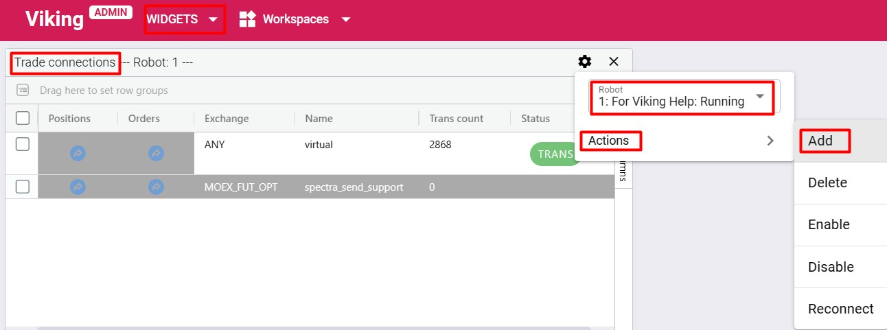
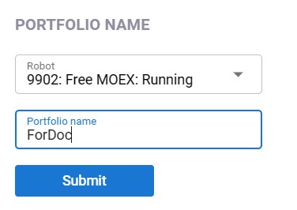
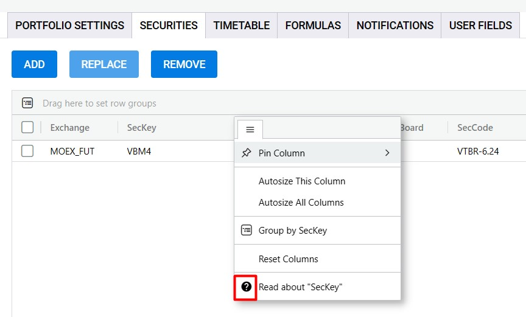

# **3. Начало работы**

Изначально, робот, созданный для клиента, не имеет транзакционных подключений и может не иметь активных необходимых маркетдата подключений к биржам (это не касается тестовых роботов для виртуальной торговли, в них сразу доступно получение маркетдаты со всех поддерживаемых бирж). Поэтому сначала необходимо настроить подключения для получения маркетдаты, а так же добавить транзакционные подключения.

## **3.1. Настройка подключений**

Для активации маркет-дата подключений необходимо выбрать виджет `Data Connections`, отметить галочками необходимые маркет-дата подключения, нажать иконку  в верхней панели виджета, выбрать робота, для которого активируется подключение и выбрать действие `Enable`.

Для настройки торговых подключений необходимо выбрать виджет `Trade connections`, нажать иконку  в верхней панели виджета, выбрать робота, для которого добавляется подключение и выбрать действие `Add`.

В открывшемся окне необходимо заполнить поля параметров подключения.
После заполнения всех полей параметров подключения необходимо нажать `Add connection`.

В столбце `Status` виджетов `Trade connections`, `Data connections` отображаются статусы "потоков данных" соответствующих подключений к биржам. Если все статусы зеленые, то торговое/маркет-дата подключение подключено к бирже, иначе не подключено.

**Важно:** 

Если торговое подключение не подключено к бирже в торговое время в течении достаточно продолжительного интервала времени, техническая поддержка сообщает об этом клиенту. Если через 2 часа после того как клиент был проинформирован, подключение продолжает оставаться не подключенным к бирже, техническая поддержка оставляет за собой право перевести такое подключение в неактивное состояние. Это связано с тем, что некорректно настроенное подключение приводит к нежелательной и избыточной активности на бирже. В ответ на подобные действия биржа может заблокировать доступ для клиента. 

## **3.2. Тelegram-бот**

Для телеграм-оповещений используется новый телеграм-бот [FKVikingBot](https://t.me/FKVikingBot). Необходимо добавить его в свой телеграм-акаунт, перейдя по ссылке и нажав кнопку "START" в диалоге общения с телеграм-ботом. 

**Важно:** 

Новый телеграм-бот только присылает оповещения, функции управления роботом у него нет.

## **3.3. Настройка портфелей**

Для того, чтобы создать портфель, необходимо выбрать виджет `Portfolios table` и нажать `ADD` 

В открывшемся окне в выпадающем списке необходимо выбрать робота, в котором будет создан новый портфель, в поле `Portfolio name` написать имя портфеля (рекомендуется задавать говорящие имена, чтобы потом было проще ориентироваться при большом количестве портфелей) и нажать кнопку `Submit`.

Для добавления биржевых инструментов необходимо в разделе `AVAILABLE SECURITIES` в выпадающем списке в поле `Exchange` выбрать биржу (для Московской биржи с указанием рынка), нажать кнопку `Reload securuty list from exchanges`. Далее биржевой инструмент следует искать по его `SecKey` в одноименном поле. После того, как нужный инструмент найден, нажимаем иконку 

После этого выбранный инструмент отобразится в разделе `PORTFOLIO SECURITIES`

Аналогичным образом в портфель добавляются остальные инструменты. После добавления всех инструментов в портфель необходимо нажать кнопку `Apply`. 
Откроется окно с настройками портфеля. [Параметры портфеля](/docs/05-params-description.html#_5-2-параметры-портфеля) задаются на закладке `Portfolio settings`, [параметры инструментов портфеля](/docs/05-params-description.html#_5-3-параметры-инструментов-портфеля) задаются на закладке `Securities`. Подробоное описание параметров можно прочитать нажав на иконку . Для параметров инструментов портфеля иконка  находится в выпадающем списке: 

 
Перечеркнутый инструмент в портфеле означает, что срок экспирации бумаги наступит через 3 или менее суток (исключая неторговые дни). Если портфель содержит хотя бы один такой инструмент, он тоже будет отображаться перечеркнутым.

Для реальной (не виртуальной) торговли в поле `Client code` необходимо вместо значения `virtual` выбрать транзакционное подключение, которое создали ранее.

Для каждого портфеля можно настроить расписание, перейдя на закладку [Timetable](/docs/05-params-description.html#_5-2-24-timetable).
 

## **3.4. Управление портфелями**

Над таблицей портфелей находится блок кнопок, обеспечивающих управление портфелями.

Кнопка "**►**" - включает торговлю по выбранным портфелям. При настройке расписания торгов с помощью параметра [Timetable](/docs/05-params-description.html#_5-2-24-timetable) включение торговли по кнопке "**►**" не работает.

Кнопка "**■**" - выключает торговлю по выбранным портфелям. Заявки по первой ноге снимаются, заявки второй ноги остаются висеть в рынке и переставляются в соответствии с настройками [SL](/docs/05-params-description.html#_5-3-14-sl) и [Timer](/docs/05-params-description.html#_5-3-16-timer). При настройке расписания торгов с помощью параметра [Timetable](/docs/05-params-description.html#_5-2-24-Timetable) выключение торговли по кнопке "**■**" не работает.

Кнопка `Action` открывает меню действий, применимых к портфелям. Там содержатся следующие пункты:

**Hard stop** - останавливает торговлю по выбранным портфелям (снимаются галочки `re_sell, re_buy`), пытается снять выставленные заявки по обеим ногам и отключает расписание (снимается флаг [Use timetable](/docs/05-params-description.html#_5-2-24-use-timetable)). Это полная остановка торговли по выбранным портфелям, после которой не будет никаких выставлений или переставлений заявок ни по одному из инструментов портфелей.
**:Важно:**
Если в некоторых портфелях были добавлены формулы в которых настроено поведение re_sell, re_buy то торговля может продолжиться в соответствии с настроенными формулами.

**Clone portfolio** - клонирует выбранный портфель.

**Reset statuses** - сброс `Sell_status` и `Buy_status` выделенных портфелей.  
Бывают ситуации, например, когда происходят сбои в работе биржи, и получается так, что заявка выставляется роботом, а потом снимается биржей, но никак не информируя робот о снятии. В таком случае заявка зависает в своем текущем, внутреннем для робота, статусе.
Пользоваться этой кнопкой можно **ТОЛЬКО В КРАЙНИХ СЛУЧАЯХ**, когда торговля по портфелю отключена и вы уверены что нет ни одной активной заявки по данному портфелю, в противном случае робот потеряет активные заявки, что приведет к неправильной позиции по бумагам в роботе.
**:Важно:**
После использования этой кнопки необходимо убедиться, что нет никаких активных заявок на бирже и позиции на бирже соответствуют тем, что в роботе.

**Stop formulas** - останавливает торговлю по выбранным портфелям (снимаются галочки `re_sell, re_buy`), пытается снять выставленные заявки по обеим ногам и отключает расписание (снимается флаг [Use timetable](/docs/05-params-description.html#_5-2-24-use-timetable)). Так же отключаются все расчёты по формулам, т.е. снимаются флаги портфеля `Custom_trade` и `Extra_formulas` и для каждого из инструментов портфеля в полях `Count_type` и `Ratio_type` устанавливается тип, соответствующий константному значению. Для дальнейшего использования формул включать их нужно самостоятельно.

**Remove** - удаляет выделенные портфели.

**Disable/Enable** - исключает портфель из расчётов или возвращает портфель обратно в обычный режим работы. Не стоит путать эту возможность с включением и выключением торговли по портфелю. Использование Disable позволяет исключить неиспользуемый в данный момент портфель из расчётов. По всем инструментам портфеля перестанут приходить цены и строиться стаканы (только если инструменты не используются в других портфелях). Редактирование параметров портфеля в статусе Disable невозможно. Будьте внимательны! Перед тем, как перевести портфель в режим Disabled, убедитесь, что торговля по портфелю выключена, заявки по инструментам портфеля не висят на бирже и не выставляются в данный момент, кроме того, проверьте, что поля портфеля и его инструменты не используются в формулах других портфелей. Также следует учитывать, что возвращение портфеля из состояния Disabled в рабочее состояние, может привести к переоткрытию торгового стакана.

**Export/Import** - экспортировать выбранный портфель из робота на компьютер в виде `.ini` файла или импортировать портфель в робота.

Кнопка **Table** открывает меню действий, применимых к таблице. Там содержатся следующие пункты: `Columns` - меню редактирования параметров таблицы портфелей. В нём можно скрывать столбцы, перемещать их местами.

**Filter** - включение и отключение окошка фильтра над таблицей. Пункт `Show` показывает окошко фильтра, пункт `Hide` скрывает его. Фильтр служит для поиска среди своих портфелей по параметрам.

**:Важно:** На новом сайте отсутствует возможность импортировать портфель если еще нет маркет-дата подключений.

**Замена инструмента портфеля**

Если требуется поменять один из инструментов портфеля, то лучше использовать функцию замены инструмента, а не удаления с последующим добавлением нового инструмента. При замене инструмента будет отображен список всех формул всех портфелей, где используется данный инструмент. Благодаря этому, можно в полуавтоматическом режиме поменять один инструмент на новый во всех формулах. Этот механизм может быть полезен, например, при замене одного фьючерса в портфеле другим, с сохранением уже настроенных параметров у инструмента, который нужно заменить. Для того чтобы воспользоваться функцией замены инструмента, нужно зайти в настройки портфеля, в таблице `Securitie`s выбрать инструмент, который следует заменить, далее в меню `Action` выбрать пункт `Replace`.
