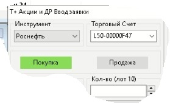

# **4. Добавление подключений**

В данном разделе описаны подключения к биржам/брокерам, рынкам, поддерживаемым роботом, и описаны все параметры, используемые при создании каждого подключения.

## **4.1. MOEX FORTS**
___

### **4.1.1. TWIME**

При заказе данного подключения следует учесть, что 2 логина по 30 транзакций/сек будут работать лучше, чем один на 60 транзакций/сек (см. [Round robin](https://bot.fkviking.com/v2/ru/doc/ru#MOEX_FORTS_TWIME_Round_robin)).

#### **4.1.1.1 Name**
        
Поле для задания имени подключения. Это значение пользователь задаёт для своего удобства, чтобы потом в списке транзакционных подключений ему было проще ориентироваться. Разрешенные символы: _ a-z A-Z 0-9.

#### **4.1.1.2 Credentials**

Credentials предоставляются брокером

#### **4.1.1.3 Trading account(s)**

Торговый счёт, предоставляется брокером. Также его еще можно посмотреть в терминале (если счетов несколько, укажите их через запятую):

#### **4.1.1.4 Comment**

Уникальный идентификатор для всех заявок для данного подключения, задаётся пользователем для собственного удобства. Если не используется, оставляйте 0. Представляет из себя целое число от 0 до 1023.

#### **4.1.1.5 Round robin**

По-умолчанию включено. Включение и выключение режима Round robin для данного подключения.
Для увеличения производительности можно использовать несколько TWIME подключений с одинаковым [Trading account(s)](https://bot.fkviking.com/v2/ru/doc/ru#MOEX_FORTS_TWIME_Trading_account). При заказе TWIME подключения следует учесть, что 2 логина по 30 транзакций/сек к одному торговому счету в режиме Round robin будут работать лучше, чем один логин на 60 транзакций/сек. В этом режиме робот будет бросать заявки в несколько логинов по-очереди.

#### **4.1.1.6 Max trans**

Лимит транзакций в секунду. В анкете у вас указана производительность логина в единицах производительности, где 1 единица равна 30 транзакциям в секунду.

#### **4.1.1.7 Reserved trans**

По-умолчанию 0. Количество зарезервированных транзакций в секунду для заявок на удаление. Использование данного параметра уменьшает количество выставлений заявки, доступных за одну секунду [Max trans](https://bot.fkviking.com/v2/ru/doc/ru#MOEX_FORTS_TWIME_Max_trans), но позволяет увеличить вероятность того, что робот успеет отдернуть (снять) заявку при уходе цен.

#### **4.1.1.8 Move order**

По-умолчанию разрешено. Разрешить или запретить использование приказов на переставление (изменение) заявки для данного подключения.

#### **4.1.1.9 Bind IP**

IP-адрес, с которого будет происходить подключение к бирже. IP адрес должен быть указан в договоре с брокером.

### **4.1.2. FAST (FIX Adapted for STreaming)**

Данное подключение имеет в своем составе 4 потока. Это сделано для того, чтобы отделить часто не используемые опционы. А также отделить ресурсоемкий но быстрый Orderlog от чуть более медленного, но лёгкого потока Best prices.

#### **4.1.2.1 Definitions**

Для того, чтобы подключение работало, нужно обязательно раздизейблить данный поток. Кроме определений инструментов, в нем также ходят торговые статусы инструментов.

#### **4.1.2.2 Best prices**

Поток лучших цен. Не является обязатеьным. Автоматически отключается при раздизейбливании потока Orderlog, т.к биржа не предусмотрела возможности объединения потоков на FAST срочного рынке.

#### **4.1.2.3 Orderlog**

Поток всех заявок. на его основании строится стакан. Является более быстрым по сравнению с потоком Best prices. При раздизейбливании данного потока автоматически отключается поток Best prices, т.к биржа не предусмотрела возможности их объединения.

#### **4.1.2.4 Options definitions**

Для того, чтобы торговать опционами, необходимо раздизейблить данный поток.
___

## **4.2. MOEX Spot**
___

### **4.2.1. FIX (Financial Information eXchange)**

При подключении к фондовому рынку советуем заказать сразу 3 (три) логина к одному торговому счету, т.к на фондовом рынке 3 (три) фикс сервера, и иногда один или два могут выйти из строя. Таким образом будет повышена отказоустойчивость вашей торговли ([см. Round robin](https://bot.fkviking.com/v2/ru/doc/ru#MOEX_SPOT_FIX_Round_robin)).

#### **4.2.1.1 Name**

Поле для задания имени подключения. Это значение пользователь задаёт для своего удобства, чтобы потом в списке транзакционных подключений ему было проще ориентироваться.

#### **4.2.1.2 Server**

Адрес FIX-сервера биржи, к которому будет выполняться подключение.

#### **4.2.1.3 SenderCompID**

Значение данного параметра предоставляется брокером.

#### **4.2.1.4 Password**

Пароль для данного FIX-подключения. Если не меняли, то используйте стандартный, указанный в поле для ввода.

#### **4.2.1.5 Trading account(s)**

Торговый счёт, предоставляется брокером. Также его еще можно посмотреть в терминале (если счетов несколько, укажите их через запятую):

#### **4.2.1.6 Round robin**

Включение и выключение Round robin'a для данного коннекта.
Для отказоустойчивости советуем использовать сразу три FIX подключения к фондовому рынку с одинаковым [Trading account(s)](https://bot.fkviking.com/v2/ru/doc/ru#MOEX_SPOT_FIX_Trading_account). В режиме Round robin робот будет изпользовать их по-очереди, и внештатное отключение одного из FIX серверов биржи не приведет к остановке торговли.

#### **4.2.1.7 Client code**

Код клиента можно посмотреть в привязанном к счёту терминале (нажать F7 и открыть таблицу "Позиции по деньгам") или запросить у брокера:

#### **4.2.1.8 Firm level account**

Указание на то, что ваш аккаунт является аккаунтом уровня фирмы. Обычно брокер не знает, какого уровня аккаунт, так что приходится подбирать.

#### **4.2.1.9 Bind IP**

IP-адрес, с которого будет происходить подключение к бирже. IP адрес должен быть указан в договоре с брокером.